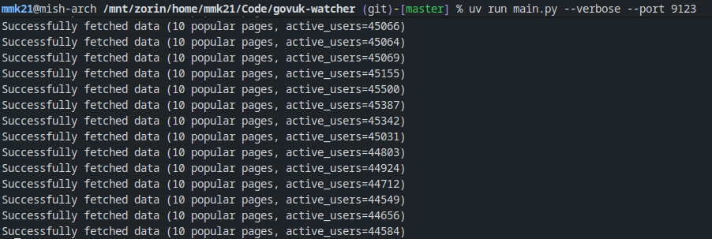
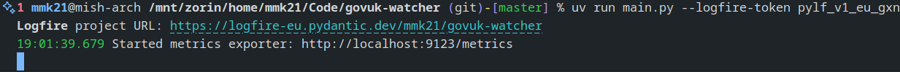

# GOV.UK Watcher

GOV.UK Watcher is a work-in-progress Python tool that exports metrics from the [GOV.UK analytics display screen](https://govuk-display-screen-20e334eeb1ba.herokuapp.com/) for Prometheus-compatible databases.

<!-- ## Online demo

[][demo]

**[🌍 View dashboard on grafana.slevel.xyz][demo]** <!-- TODO Replace the below with demo link (Grafana dashboard) -->

[demo]: https://example.com -->

## Local development

This project uses Python (3.9+) and [uv](https://docs.astral.sh/uv/) for development.

1. Clone the repo
2. `uv run main.py`
3. Head to <http://localhost:9050/metrics> to see the metrics

## Command-line options

All command-line options are optional.

- `--interval <seconds>`: how often to fetch data, in seconds
  - Warning: If this isn't a multiple of 60, the `active_users_30_minutes` metric will have some noise because GOV.UK only provides accurate values at the end of each minute.
  - If this is a multiple of 60, the script will automatically fetch data at the end of the minute, to get the most accurate values.
  - Defaults to every minute (`60` seconds), which gives the most frequent accurate data updates.
- `--port <port>`: the port to run the Prometheus exporter on (default: `9050`)
- `-v` / `--verbose`: log whenever data is scraped
  
- `--logfire-token <token>`: a [Logfire](https://logfire.pydantic.dev/) token for sending logs to the cloud
  
  - This lets you use Logfire (an external cloud service) to monitor the logs of the exporter in production
  - If enabled, the `--verbose` option will have no effect (verbose logs are always sent to Logfire)
  - If not provided, no communications to Logfire will be made

## Production deployment with Docker Compose

1. Download the example Compose file from [deployment/docker-compose.yml](deployment/docker-compose.yml). Feel free to adjust it to your needs.
2. Start it with `docker-compose up -d`
3. Metrics should now be available at <http://localhost:9050/metrics>

### Example `prometheus.yml` config

Start tracking the metrics by adding Daydream Watcher as a scrape config to a Prometheus-compatible database (e.g. Prometheus, VictoriaMetrics).

```yaml
scrape_configs:
  - job_name: govuk-watcher
    scrape_interval: "10s"
    static_configs:
      - targets: ["govuk-watcher:9050"]
```

<!-- ### Example Grafana dashboard

Start visualising the metrics by importing the example Grafana dashboard at [deployment/grafana-dashboard.json](deployment/grafana-dashboard.json) into your Grafana instance. -->

## Maintainers: Releasing a new version

Use the `release-new-version.sh` shell script, e.g.

```bash
./release-new-version.sh 0.2.1
```

It will

1. Bump the version in `pyproject.toml`
2. Create and push a Git tag for the new version
3. Build and publish the Docker image to Docker Hub

Then, manually check that the version bump commit is as expected, and `git push` it.
